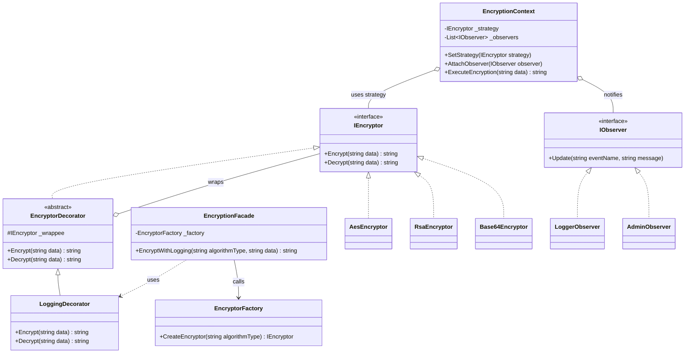

# Yazılım Tasarım Örüntüleri Ödevi - Şifreleme Aracı

## Neden "E" (Şifreleme Aracı) Seçildi?
Bu projede şifreleme aracını seçmemin temel nedeni, siber güvenliğe olan kişisel ilgimdir. Güvenlik yazılımlarında algoritmaların değişebilirliği (örneğin eski bir algoritmanın yerine hızlıca yenisinin entegre edilebilmesi) kritik bir öneme sahiptir. Nesne tabanlı tasarım örüntüleri, bu tarz esneklikleri sağlamak için en uygun zeminleri sunar.

Projede, başlangıçta kötü tasarlanmış (God Class) bir şifreleme sınıfının adım adım **Creational**, **Structural** ve **Behavioral** örüntüler kullanılarak nasıl SOLID prensiplerine uygun, esnek ve genişletilebilir bir mimariye dönüştürüldüğünü görebilirsiniz.

---

## Uygulanan Tasarım Örüntüleri (Design Patterns)

Projemizin refactoring sürecinde aşağıdaki tasarım örüntüleri kullanılmıştır:

1. **Factory Method (Creational):** Nesne üretim sorumluluğunu merkezi bir fabrika sınıfına (`EncryptorFactory`) alarak istemci kod ile şifreleme algoritmaları (`AesEncryptor`, `RsaEncryptor`) arasındaki bağımlılığı (tight coupling) kopardık.
2. **Decorator (Structural):** Mevcut şifreleyici nesnelere dokunmadan çalışma anında dinamik olarak ek davranışlar (örneğin `LoggingDecorator` ile loglama) kazandırdık.
3. **Facade (Structural):** Factory ve Decorator bileşenlerinin istemci tarafından kullanım zorluğunu gizlemek için tek bir `EncryptionFacade` servisi sağladık.
4. **Strategy (Behavioral):** Şifreleme algoritmasını `EncryptionContext` üzerinden çalışma anında değiştirilebilir (`SetStrategy`) hale getirip if-else bloklarından tamamen kurtulduk.
5. **Observer (Behavioral):** Şifreleme işlemleri sırasında veya hata anında sistemi izleyen bağımsız birimleri (`AdminObserver`, `LoggerObserver`) otomatik olarak uyaracak olay tabanlı bir sistem kurduk.

---

## Proje Klasör Yapısı

```text
src/
├── Algorithms/       # AES, RSA ve Base64 şifreleme sınıfları
├── Core/             # Temel arayüzler (IEncryptor)
├── Decorators/       # Şifreleme işlemlerine ek davranış katan sarmalayıcılar (Logging vb.)
├── Facade/           # Karmaşıklığı gizleyen basit kullanım servisi
├── Factory/          # Nesne yaratımından sorumlu fabrika sınıfı
├── Legacy/           # Örüntüler uygulanmadan önceki kötü "God Class" kodu (EncryptionProvider)
├── Observers/        # Sistemi dinleyen Observer sınıfları (Log ve Admin)
└── Strategy/         # Strateji mantığını yürüten Context sınıfı (EncryptionContext)
```

---

## Final Mimari UML Diyagramı


