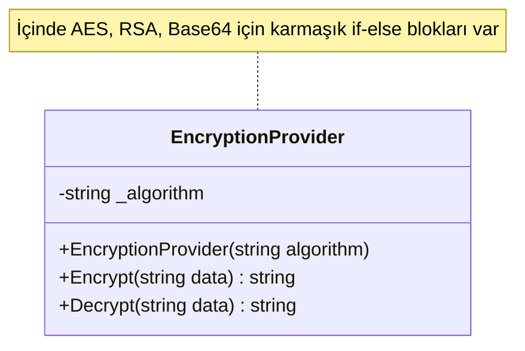
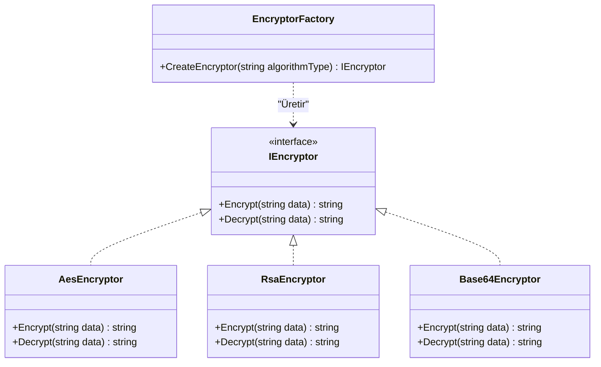

# UML Diyagramları

## Öncesi: Kötü Tasarım (God Class)

```mermaid
classDiagram
    class EncryptionProvider {
        -string _algorithm
        +EncryptionProvider(string algorithm)
        +Encrypt(string data) string
        +Decrypt(string data) string
    }
    note for EncryptionProvider "İçinde AES, RSA, Base64 için karmaşık if-else blokları var"
```

## Sonrası: Faz 1 - Factory Method

```mermaid
classDiagram
    class IEncryptor {
        <<interface>>
        +Encrypt(string data) string
        +Decrypt(string data) string
    }

    class AesEncryptor {
        +Encrypt(string data) string
        +Decrypt(string data) string
    }

    class RsaEncryptor {
        +Encrypt(string data) string
        +Decrypt(string data) string
    }

    class Base64Encryptor {
        +Encrypt(string data) string
        +Decrypt(string data) string
    }

    class EncryptorFactory {
        +CreateEncryptor(string algorithmType) IEncryptor
    }

    IEncryptor <|.. AesEncryptor
    IEncryptor <|.. RsaEncryptor
    IEncryptor <|.. Base64Encryptor
    EncryptorFactory ..> IEncryptor : "Üretir"
```
